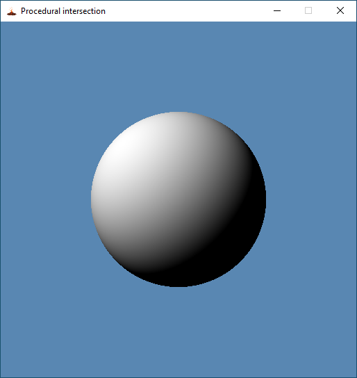

# Basic ray-tracing samples using Magma library and Vulkan graphics API

## Cloning

To clone this repository with external submodules:
```
git clone --recursive https://github.com/vcoda/basic-raytracing-samples.git
``` 
or clone this repository only and update submodules manually:
```
git clone https://github.com/vcoda/basic-raytracing-samples.git
cd basic-raytracing-samples
git submodule update --init --recursive
``` 

## Build Tools and SDK

## Windows

* [Microsoft Visual Studio Community](https://www.visualstudio.com/downloads/)<br>
* [Git for Windows](https://git-scm.com/download)<br>
* [LunarG Vulkan SDK](https://www.lunarg.com/vulkan-sdk/)<br>

Check that VK_SDK_PATH environment variable is present after SDK installation:
```
echo %VK_SDK_PATH%
```
Shaders are automatically compiled using glslangValidator as Custom Build Tool.
If you use Visual Studio newer than 2017, change the SDK version in the project property pages or by right-clicking the solution and selecting "Retarget solution".
</br>

## Linux (Ubuntu)

Install GCC and Git (if not available):
```
sudo apt update
sudo apt install gcc
sudo apt install g++
sudo apt install make
sudo apt install git
```
Install XCB headers and libraries:
```
sudo apt install xcb
sudo apt install libxcb-icccm4-dev
```
For Xlib, install X11 headers and libraries (optional):
```
sudo apt install libx11-dev
```

* [LunarG Vulkan SDK](https://www.lunarg.com/vulkan-sdk/)<br>

Go to the directory where .run file was saved:
```
chmod ugo+x vulkansdk-linux-x86_64-<version>.run
./vulkansdk-linux-x86_64-<version>.run
cd VulkanSDK/<version>/
source ./setup-env.sh
```
Check that Vulkan environment variables are present:
```
printenv | grep Vulkan
```

### Systems with AMD graphics hardware

Check whether AMDGPU-PRO stack is installed:
```
dpkg -l amdgpu-pro
```
If not, download and install it from an official web page:

* [AMD Radeon™ Software AMDGPU-PRO Driver for Linux](https://support.amd.com/en-us/kb-articles/Pages/AMDGPU-PRO-Install.aspx)<br>

NOTE: You have to make sure that graphics driver is compatible with current Linux kernel. Some of the driver's libraries are ***compiled*** against installed kernel headers, and if kernel API changed since driver release, compilation will fail and driver become malfunction after reboot. I used a combination of AMDGPU-PRO Driver Version 17.10 and Ubuntu 16.04.2 with kernel 4.8.0-36. Also disable system update as it may upgrade kernel to the version that is incompatible with installed graphics driver. 
Successfull AMDGPU-PRO installation should look like this:
```
Loading new amdgpu-pro-17.10-446706 DKMS files...
First Installation: checking all kernels...
Building only for 4.8.0-36-generic
Building for architecture x86_64
Building initial module for 4.8.0-36-generic
Done.
Forcing installation of amdgpu-pro
```
After reboot check that driver stack is installed:
```
dpkg -l amdgpu-pro
Desired=Unknown/Install/Remove/Purge/Hold
| Status=Not/Inst/Conf-files/Unpacked/halF-conf/Half-inst/trig-aWait/Trig-pend
|/ Err?=(none)/Reinst-required (Status,Err: uppercase=bad)
||/ Name                            Version              Architecture         Description
+++-===============================-====================-====================-====================================================================
ii  amdgpu-pro                      17.10-446706         amd64                Meta package to install amdgpu Pro components.
```
### Systems with Nvidia graphics hardware

TODO

### Hardware Requirements

These demos require GPU with hardware ray-tracing support. Graphics driver and Vulkan SDK should support the following extensions:

* VK_KHR_acceleration_structure
* VK_KHR_buffer_device_address
* VK_EXT_descriptor_indexing
* VK_KHR_ray_query
* VK_KHR_ray_tracing_pipeline
* VK_KHR_spirv_1_4

### Building

To build all samples, go to the repo root directory and run make script:
```
make -j<N>
```
where N is the number of threads to run with multi-threaded compilation. First, magma and quadric libraries will be built, then samples.
To build a particular sample, you can build dependencies separately, then go to the sample's directory and run make script:
```
cd 01-triangle
make
./01-triangle
```
There is debug build by default. For release build, set DEBUG variable to 0, e. g.:
```
make magma DEBUG=0 -j<N>
```

## Samples

### [01 - Hello, triangle!](01-triangle/)

This very first sample renders a triangle using hardware ray-tracing instead of conventional rasterization.
It shows how to allocate top- and bottom-level acceleration structures, build them on device, and how to run 
ray-tracing shader to find closest intersection of ray with geometry.
<br><br><br><br>

### [02 - Perspective transformation](02-transform/)

Calculates origin and direction of the ray using inverted view and projection matrices. Triangle's world transformation
stored in the instance buffer bound to top-level acceleration structure. To apply transformation, acceleration structure 
is updated every frame.
<br><br><br><br>

### [03 - Procedural intersection](03-procedural-intersection/)

Current hardware is able to trace rays only against triangles or AABBs. In case of a custom shape,
a special intersection shader may be injected into pipeline. First, we define AABB that describes bounds of our shape. 
Next, if intersection of ray and AABB is found, then intersection shader is invoked. This shader may compute intersection 
programmatically with arbitrary shape like sphere, cylinder, cone, torus etc. In this example an optimized intersection 
with a sphere is provided.
<br><br><br>

### [04 - Alpha texture](04-texture-alpha/)

Demonstrates how to invoke ray trace instruction recursively to implement alpha test. 
When ray hits a triangle, we use barycentric coordinates to interpolate per-vertex texture coordinates across this triangle. 
Then we sample triangle's texture and use its alpha value to decide, whether we should stop and return sampled color or
we should continue by invoking ray trace instruction one more time.
<br><br><br><br>

### [05 - Mesh](05-mesh/)

Draws a triangle mesh loaded from from Wavefront obj file. Vertices are stored in a storage buffer used for both acceleration structure
construction and accesing data in the hit shader. When ray hits a triangle, we load triangle's vertices and compute its face normal.
Dot product between normal and direction to light source is computed for diffuse reflection.
<br><br><br><br>

### [06 - Model](06-model/)

This sample generalizes previous one by loading Wavefront obj file that consists of multiple shapes. In addition to position, a vertex 
may have a normal, texture coordinate and color attributes. Components of normal and color are quantized to 8 bits and unpacked in the hit
shader using unpackUnorm4x8() function. To fetch data of each individual geometry, we use so-called "buffer references" that actually 
represent device memory addresses of vertex and index buffers. References require support of 64-bit arithmetic type from hardware.
<br><br>

## Credits
This framework uses a few third-party libraries:

* [Microsoft DirectXMath](https://github.com/Microsoft/DirectXMath)<br>
  Linear algebra library with fantastic CPU optimizations using SSE2/SSE3/SSE4/AVX/AVX2 intrinsics.<br>
  I wrote a simple [wrapper](https://github.com/vcoda/rapid) over it to make its usage more OOP friendly.

* [tinyobjloader](https://github.com/tinyobjloader/tinyobjloader)<br>
  Tiny but powerful single file wavefront obj loader by Syoyo Fujita.

* [stb](https://github.com/nothings/stb)<br>
  Sean T. Barrett's single-header image loading library.
